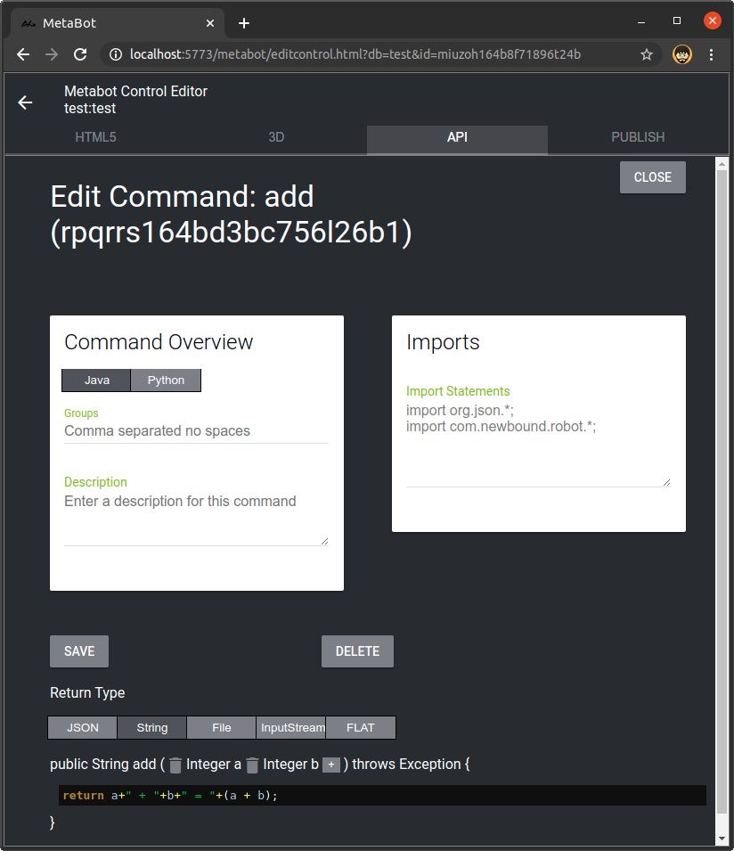

# newbound_discord
Select any Newbound Metabot Control to act as a Discord bot. Once connected to your Discord server, all the Commands in the Control's API become commands you can invoke from Discord. The Newbound Discord app will listen for messages that start with an exclamation point (!) and call the Command named with whatever follows the exclamation point. Parameters to the Command follow the command name with spaces between them.

# Dependencies
1. This project requires an up-to-date working installation of the Newbound software
   https://github.com/mraiser/newbound

2. Discord4J and dependencies
   https://search.maven.org/artifact/com.discord4j/discord4j-core/3.1.2/jar

# Installation
1. Move the data/discord and runtime/discord folders into your Newbound installation's data and runtime folders, respectively
2. Download the Discord4J jar files and their dependencies and drop them in your Newbound installation's "lib" folder
3. Launch the Newbound software
4. Publish the "discord" control in the "discord" library using the Metabot app
5. Restart the Newbound software

*Instead of moving the data/discord and runtime/discord folders you can create symbolic links to them, leaving your git project folder intact for easy updating*

# Demo
[](http://www.youtube.com/watch?v=2CnYH8UGGNw "Newbound DiscordBot")

# Examples
These examples assume you have created a new library called "test" and added a control called "test" and have enabled it as a bot using the Newbound Discord app are currently editing the API of that control using the Metabot.

## Add two numbers

1. Add a new Command named "add" and edit it
2. Set the return type to String
3. Add Integer parameters "a" and "b"
4. Set the code to:
```java
return a+" + "+b+" = "+(a + b);
```
## Send an embed
1. Add a new Command named "embed" and edit it
2. Set the return type to String
3. Add JSONObject parameter "discordevent"
4. Set the imports to:
```java
import org.json.*;
import com.newbound.robot.*;
import com.newbound.robot.published.DiscordBot;
import com.newbound.robot.published.discord.Bot;
import discord4j.core.object.entity.channel.MessageChannel;
import discord4j.core.event.domain.message.MessageCreateEvent;
```
5. Set the code to:
```java
DDiscordBot db = DiscordBot.getDiscord();
MessageCreateEvent event = (MessageCreateEvent)discordevent.get("event");
MessageChannel c = event.getMessage().getChannel().block();
Bot bot = (Bot)discordevent.get("bot");

JSONObject jo = new JSONObject();
jo.put("title", "Testing embed");
jo.put("description", "Cool, no?");
jo.put("color", 3447003);

JSONObject img = new JSONObject();
img.put("url", "https://www.newbound.com/botmanager/asset/site/newbound-hd-color.png");
jo.put("image", img);

img = new JSONObject();
img.put("url", "https://www.newbound.io/botmanager/asset/newboundio/newbound-icon-small-white.png");
jo.put("thumbnail", img);

bot.sendEmbed("Holy moley, it's an embed", jo, c);

return "(yay)";
```
## Take a webcam snapshot
*Requires the newbound_raspberrypi app (https://github.com/mraiser/newbound_raspberrypi) to be installed on peers you are connected to via the PeerBot*
1. Add a new Command named "snapshot" and edit it
2. Set the return type to String
3. Add String parameter "peer"
4. Add JSONObject parameter "discordevent"
5. Set the imports to:
```java
import org.json.*;
import com.newbound.robot.*;
import com.newbound.net.mime.Base64Coder;
import java.util.*;
import java.io.*;
import com.newbound.robot.published.DiscordBot;
import com.newbound.robot.published.discord.Bot;
import discord4j.core.object.entity.channel.MessageChannel;
import discord4j.core.event.domain.message.MessageCreateEvent;
import java.text.SimpleDateFormat;
```
6. Set the code to:
```java
Date d = new Date();
String peername = peer;
String filename = peer+"_"+d.getTime()+".jpg";

// Probably safer to hard code the UUIDs of the peers you want to include rather than looking up the UUIDs by peer name.
if (peer.equals("beebot1")) peer = "99999999-9999-9999-9999-999999999999";
else if (peer.equals("videobot")) peer = "88888888-8888-8888-8888-888888888888";
else throw new Exception("Unknown device: "+peer);

PeerBot pb = PeerBot.getPeerBot();
Hashtable h = new Hashtable();
h.put("db", "raspberrypi");
h.put("name", "cameramodule");
h.put("cmd", "jpeg");
h.put("args", new JSONObject("{\"time\":"+d.getTime()+"}"));
JSONObject jo = pb.sendCommand(peer, "metabot", "call", h);
System.out.println(jo);
String fu = jo.getString("msg");
System.out.println(fu);
String imgstr = pb.getUploadedFile(peer, fu);
File f = new File(imgstr);

if (discordevent.has("event")) // Request is from Discord
{
  String pattern = "yyyy-MM-dd HH:mm:ssZ";
  SimpleDateFormat simpleDateFormat = new SimpleDateFormat(pattern);
  String date = simpleDateFormat.format(d);
  String title = "Snapshot: "+peername+" "+date;

  DiscordBot db = DiscordBot.getDiscord();
  MessageCreateEvent event = (MessageCreateEvent)discordevent.get("event");
  MessageChannel c = event.getMessage().getChannel().block();
  Bot bot = (Bot)discordevent.get("bot");
  
  bot.sendFile(title, filename, f, c);
  return null;
}
else // Request is NOT from Discord, return a data-uri of the image
{
  byte[] ba = BotUtil.readFile(f);
  String base64str = new String(Base64Coder.encode(ba));
  String uri = "data:image/jpg;base64,"+base64str;

  return uri;
}
```
